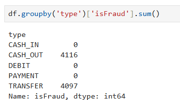
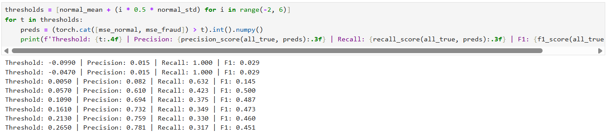
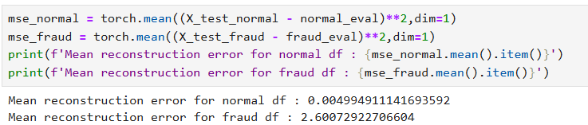
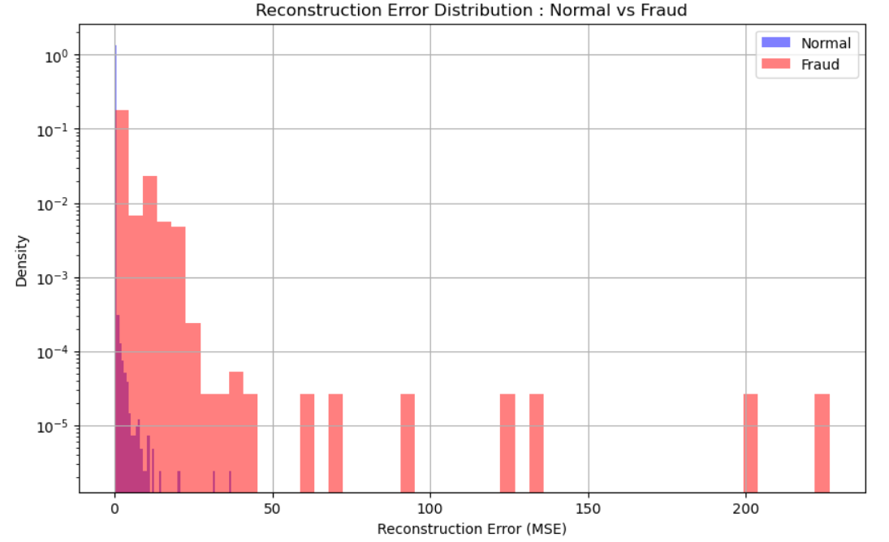

# SPENDING ANOMALY DETECTOR
## Project Overview
A personal spending anomaly detector trained on normal transactions using the autoencoder architecture.

### Why choose an autoencoder architecture?
Traditional methods for fraud detection consists of a binary classifier trained on a balanced labelled datasets. But, in the case of imbalanced datasets it may fail to detect a fraudulent transaction. An autoencoder deals with this effectively as it is only trained on normal transactions and uses reconstruction errors to detect for an anomaly.

### Dataset Used
Paysim Mobile Money Transactions Dataset from Kaggle was used to train the model. It is a simulated mobile financial transaction dataset which is based on real transaction logs from a mobile money service. It contains about 6.3 million records and 11 features including a label for fraud but it was removed in preprocessing before using it to train the model. The dataset also included various types of payment involved and only CASH_OUT and TRANSFER were selected to proceed with, which left us 2.7 million records to work with.

A huge reason to use this dataset is that the severity of the data being imbalanced is high which makes standard classifiers unreliable.
Dataset Link - [Paysim Dataset](https://www.kaggle.com/datasets/ealaxi/paysim1)

### Results
I started with a threshold of mean + (2*standard deviation) of the data to follow the empirical rule. Even though the precision was around 80%, the recall was significantly low (about 20%). In a fraud detection system, failing to catch a fraud transaction is a more critical mistake than flagging a non-fraudulent transaction as fraud. So, in order to check for potential tradeoffs I calculated thresholds and their corresponding precision, recall and F1 score for a range of values and found 0.057 to be the most optimal threshold.

After training on normal transactions the model was evaluated through a set of data which contained normal transactions and a set of data which contained fraud transactions. The mean reconstruction error values were calculated for both the scenario.

The model showed very minimal error during reconstruction of the normal transaction since the pattern was very familiar to it. But, in the second scenario it wasn't able to reconstruct the transactions as effectively as the first one. The difference between these two cases is huge.

The higher the error value, the more suspicious it turns out to be. Any reconstruction error value exceeding the threshold is flagged as an anomaly.

### Limitations
- Precision is approx 61% and recall is approx 42%. These scores are the metrics found within this model but still may not be good enough as it may still miss few fraud cases.
- The csv file to be uploaded requires to be in a specified structure. The structure is mentioned in the webpage and it won't work for users who may not have required info for the model.

## License
This project is open-source and available under the MIT License.

## Contact
For issues or questions, please open a GitHub issue.